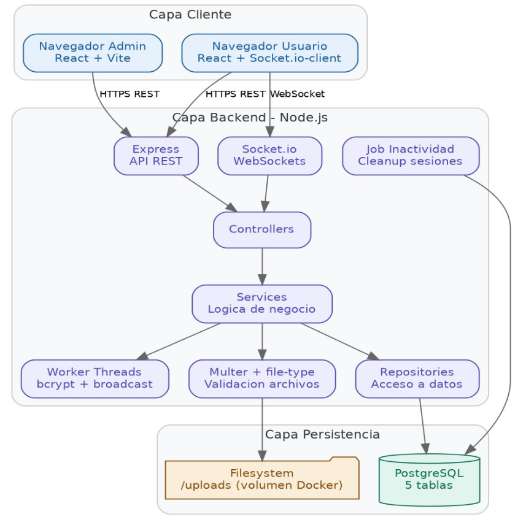

# SecureWork Rooms

Sistema de chat en tiempo real con salas seguras.  
**Stack:** Node.js + Express + Socket.io | React + Vite + TailwindCSS | PostgreSQL | Supabase Auth  
**Materia:** Aplicaciones Distribuidas — ESPE | **Equipo:** 3 personas 

---

## Requisitos previos

| Herramienta | Versión mínima | Windows | Linux |
|---|---|---|---|
| Docker Desktop / Docker Engine | 24+ | [Docker Desktop](https://www.docker.com/products/docker-desktop/) | `sudo apt install docker.io docker-compose-plugin` |
| Git | cualquiera | [git-scm.com](https://git-scm.com) | `sudo apt install git` |
| Node.js (opcional, solo para tests locales) | 18+ | [nodejs.org](https://nodejs.org) | `sudo apt install nodejs` |

> En Windows: usar **PowerShell** o **Git Bash** para los comandos. NO usar CMD.

---

## Instalación paso a paso

### 1. Clonar el repositorio

```bash
git clone https://github.com/TU_USUARIO/securework-rooms.git
cd securework-rooms
git checkout develop
```

### 2. Configurar variables de entorno

```bash
# Linux / Git Bash en Windows
cp .env.example .env
```

En Windows PowerShell:
```powershell
Copy-Item .env.example .env
```

Editar `.env` con las credenciales que te pase el Backend Lead:

```env
DB_USER=securework_user
DB_PASSWORD=la_password_que_te_pasen
SUPABASE_URL=https://xxxx.supabase.co
SUPABASE_ANON_KEY=eyJ...
SUPABASE_JWT_SECRET=el_jwt_secret
SESSION_TOKEN_SECRET=el_session_secret
HOST_IP=localhost
```

> **Para demo en LAN:** cambiar `HOST_IP` a la IP del host que levanta Docker.  
> Windows: `ipconfig` → buscar IPv4  
> Linux: `ip addr` → buscar inet en la interfaz activa

### 3. Levantar con Docker Compose

```bash
docker compose up --build
```

Primera vez tarda ~3-5 minutos descargando imágenes. Las siguientes veces es instantáneo.

Cuando veas esto, está listo:
```
backend-1  | Backend corriendo en http://0.0.0.0:3000
frontend-1 | VITE v5.x.x  ready in XXXms
```

### 4. Ejecutar migraciones (solo la primera vez)

```bash
docker compose exec backend npm run migrate
```

Esperado:
```
Ejecutando: 001_salas.sql ✓
Ejecutando: 002_sesiones.sql ✓
Ejecutando: 003_mensajes.sql ✓
Ejecutando: 004_archivos.sql ✓
Migraciones completadas.
```

### 5. Verificar que todo funciona

```bash
# Linux / Git Bash
curl http://localhost:3000/api/health

# PowerShell
Invoke-WebRequest http://localhost:3000/api/health | Select-Object -ExpandProperty Content
```

Respuesta esperada:
```json
{"status":"ok","uptime":12.3,"db":"connected","supabase":"ok"}
```

Abrir en el navegador: **http://localhost:5173**

---

## Comandos útiles

```bash
# Ver logs en tiempo real
docker compose logs -f backend
docker compose logs -f frontend

# Reiniciar solo el backend (tras cambios manuales)
docker compose restart backend

# Detener todo
docker compose down

# Detener y borrar volúmenes (reset completo de BD)
docker compose down -v

# Entrar a la BD directamente
docker compose exec postgres psql -U securework_user -d securework

# Ver tablas
docker compose exec postgres psql -U securework_user -d securework -c "\dt"
```

---

## Estructura del proyecto

### Diagrama de arquitectura



*Figura 1. Arquitectura general: Cliente → Backend (3 capas + Worker Threads) → Persistencia.*

```
securework-rooms/
├── .env.example              ← variables de entorno (copiar a .env)
├── .gitattributes            ← normalización LF/CRLF Windows+Linux
├── docker-compose.yml
├── backend/
│   ├── nodemon.json          ← config hot-reload (compatible Windows)
│   ├── migrations/           ← SQL: salas, sesiones, mensajes, archivos
│   ├── uploads/              ← archivos subidos por usuarios
│   └── src/
│       ├── config/           ← DB, Supabase, logger
│       ├── controllers/      ← HTTP handlers por recurso
│       ├── services/         ← lógica de negocio
│       ├── repositories/     ← queries SQL
│       ├── middleware/       ← auth JWT, session token, upload, errores
│       ├── workers/          ← Worker Threads: bcrypt, broadcast, file-validation
│       ├── routes/           ← registro de rutas Express
│       ├── jobs/             ← job de limpieza de sesiones inactivas
│       └── utils/            ← WorkerPool, pin-generator, ip-extractor
└── frontend/
    └── src/
        ├── pages/            ← 8 pantallas del sistema
        ├── components/       ← chat/, admin/, common/
        ├── services/         ← api.js, supabase, socket, device
        ├── hooks/            ← useAuth, useSocket, useSala, useDeviceId
        ├── context/          ← AuthContext, SocketContext
        └── utils/            ← formatters, fingerprint
```

---

## API REST — Endpoints

### Auth (administrador)

| Método | Ruta | Auth | Descripción |
|---|---|---|---|
| GET | `/api/health` | ninguna | Estado del sistema |
| GET | `/api/auth/verify` | JWT Supabase | Verifica token admin |
| GET | `/api/auth/me` | JWT Supabase | Datos del admin actual |

**Header requerido para rutas admin:**
```
Authorization: Bearer <JWT_de_Supabase>
```

### Salas (administrador)

| Método | Ruta | Auth | Descripción |
|---|---|---|---|
| GET | `/api/salas` | JWT Supabase | Listar todas las salas |
| POST | `/api/salas` | JWT Supabase | Crear sala nueva |
| GET | `/api/salas/:id` | JWT Supabase | Ver detalle de sala |
| DELETE | `/api/salas/:id` | JWT Supabase | Eliminar sala |
| DELETE | `/api/salas/:id/usuarios/:nickname` | JWT Supabase | Expulsar usuario |

**Body para crear sala:**
```json
{
  "nombre": "Sala de Sistemas",
  "tipo": "texto",
  "max_size_mb": 5,
  "timeout_min": 10
}
```

**Respuesta crear sala:**
```json
{
  "id": "uuid",
  "nombre": "Sala de Sistemas",
  "tipo": "texto",
  "pin_plano": "482910",
  "max_file_size_mb": 5,
  "timeout_inactividad_min": 10,
  "creada_en": "2026-05-01T15:00:00.000Z",
  "activa": true
}
```

### Salas (usuarios anónimos)

| Método | Ruta | Auth | Descripción |
|---|---|---|---|
| POST | `/api/salas/unirse` | ninguna | Unirse a sala con PIN |

**Body:**
```json
{
  "nombre_sala": "Sala de Sistemas",
  "pin": "482910",
  "nickname": "juan123",
  "device_id": "uuid-generado-en-frontend",
  "fingerprint": "sha256-del-navegador"
}
```

**Respuesta exitosa:**
```json
{
  "sala_id": "uuid",
  "sala_tipo": "texto",
  "session_token": "uuid"
}
```

**Errores posibles:**

| Código HTTP | codigo | Causa |
|---|---|---|
| 401 | `PIN_INVALIDO` | PIN incorrecto |
| 409 | `NICKNAME_DUPLICADO` | Nickname ya usado en la sala |
| 409 | `DEVICE_EN_OTRA_SALA` | El dispositivo ya está en otra sala |

### Archivos

| Método | Ruta | Auth | Descripción |
|---|---|---|---|
| POST | `/api/salas/:id/archivos` | Session Token | Subir archivo |
| GET | `/api/archivos/:id` | Session Token | Descargar archivo |

**Header requerido:**
```
X-Session-Token: <session_token_del_unirse>
```

**Tipos permitidos:** jpg, jpeg, png, gif, webp, pdf, txt, md  
**Tamaño máximo:** 10MB  
**Rechazados:** exe, bat, sh, zip, rar, docx, xlsx, html, js, mp3, mp4

---

## WebSocket — Eventos Socket.io

**Conexión:**
```javascript
const socket = io('http://localhost:3000', {
  auth: {
    session_token: 'el_token_del_unirse',
    device_id: 'el_device_id_del_localStorage'
  }
});
```

### Eventos cliente → servidor

| Evento | Payload | Descripción |
|---|---|---|
| `sala:join` | `{ sala_id }` | Unirse al room de la sala |
| `mensaje:enviar` | `{ contenido }` | Enviar mensaje de texto |
| `mensaje:typing` | ninguno | Indicador de escritura |
| `archivo:notificar` | `{ archivo_id }` | Notificar archivo subido |
| `actividad:ping` | ninguno | Heartbeat cada 30s |
| `sala:salir` | ninguno | Salir voluntariamente |

### Eventos servidor → cliente

| Evento | Payload | Cuándo |
|---|---|---|
| `sala:joined` | `{ sala, usuarios, mensajes_recientes }` | Tras sala:join exitoso |
| `mensaje:nuevo` | `{ id, sala_id, nickname, contenido, enviado_en }` | Broadcast de mensaje |
| `usuario:entro` | `{ nickname }` | Alguien se conectó |
| `usuario:salio` | `{ nickname, motivo }` | Alguien se desconectó |
| `usuario:escribiendo` | `{ nickname }` | Indicador de escritura |
| `sesion:expulsado` | `{ motivo }` | Expulsado por admin o inactividad |
| `sala:cerrada` | `{ motivo }` | Admin eliminó la sala |
| `error` | `{ codigo, mensaje }` | Error genérico |

---

## Modelo de datos

```
salas
  id, nombre, tipo (texto|multimedia), pin_hash, pin_plano,
  max_file_size_mb, timeout_inactividad_min, creada_por (UUID Supabase),
  creada_en, activa

sesiones_activas
  id, sala_id → salas, nickname, device_id (UNIQUE global),
  fingerprint, ip, socket_id (UNIQUE), session_token (UNIQUE),
  ultima_actividad, conectado_en
  UNIQUE (sala_id, nickname)

mensajes
  id, sala_id → salas, nickname, contenido (max 2000), enviado_en
  INDEX (sala_id, enviado_en DESC)

archivos
  id, sala_id → salas, mensaje_id → mensajes (nullable),
  nombre_original, ruta_storage (UNIQUE), mime_type,
  tamanio_bytes, subido_por_nickname, subido_en
```

---

## Probar manualmente (Linux y Git Bash en Windows)

### Obtener token admin

```bash
# Pedir al Backend Lead el email y password del admin de Supabase
TOKEN=$(docker compose exec backend node -e "
const { createClient } = require('@supabase/supabase-js');
const s = createClient('TU_SUPABASE_URL', 'TU_ANON_KEY');
s.auth.signInWithPassword({ email: 'admin@ejemplo.com', password: 'tu_password' })
  .then(r => console.log(r.data.session.access_token));
" 2>/dev/null)

echo "TOKEN: ${TOKEN:0:30}..."
```

### Flujo completo de prueba

```bash
# 1. Health check
curl http://localhost:3000/api/health

# 2. Verificar auth admin
curl -H "Authorization: Bearer $TOKEN" http://localhost:3000/api/auth/verify

# 3. Crear sala
curl -X POST http://localhost:3000/api/salas \
  -H "Authorization: Bearer $TOKEN" \
  -H "Content-Type: application/json" \
  -d '{"nombre":"Sala Test","tipo":"texto","max_size_mb":5,"timeout_min":5}'

# Guardar id y pin_plano de la respuesta
SALA_ID="el_id_de_la_respuesta"
PIN="el_pin_de_la_respuesta"

# 4. Unirse como usuario anónimo
SESSION=$(curl -s -X POST http://localhost:3000/api/salas/unirse \
  -H "Content-Type: application/json" \
  -d "{\"nombre_sala\":\"Sala Test\",\"pin\":\"$PIN\",\"nickname\":\"juan\",\"device_id\":\"dev-001\",\"fingerprint\":\"abc\"}")
echo $SESSION

SESSION_TOKEN=$(echo $SESSION | grep -o '"session_token":"[^"]*"' | cut -d'"' -f4)

# 5. Subir archivo (solo salas multimedia)
curl -X POST http://localhost:3000/api/salas/$SALA_ID/archivos \
  -H "X-Session-Token: $SESSION_TOKEN" \
  -F "archivo=@/ruta/a/imagen.jpg"

# 6. Probar rechazos
# PIN incorrecto
curl -X POST http://localhost:3000/api/salas/unirse \
  -H "Content-Type: application/json" \
  -d '{"nombre_sala":"Sala Test","pin":"0000","nickname":"u2","device_id":"dev-002","fingerprint":"x"}'

# Mismo device → 409
curl -X POST http://localhost:3000/api/salas/unirse \
  -H "Content-Type: application/json" \
  -d "{\"nombre_sala\":\"Sala Test\",\"pin\":\"$PIN\",\"nickname\":\"u2\",\"device_id\":\"dev-001\",\"fingerprint\":\"x\"}"
```

### Probar WebSocket

```bash
# Instalar cliente (una sola vez)
npm install -g wscat  # puede requerir sudo en Linux

# Conectar — Socket.io NO es WebSocket puro, usar socket.io-client
docker compose exec backend node -e "
const { io } = require('socket.io-client');
const socket = io('http://backend:3000', {
  auth: { session_token: 'TU_SESSION_TOKEN', device_id: 'dev-001' }
});
socket.on('connect', () => {
  console.log('Conectado:', socket.id);
  socket.emit('sala:join', { sala_id: 'TU_SALA_ID' });
});
socket.on('sala:joined', (d) => { console.log('Estado inicial:', JSON.stringify(d, null, 2)); process.exit(0); });
socket.on('connect_error', (e) => { console.log('Error:', e.message); process.exit(1); });
setTimeout(() => process.exit(1), 5000);
"
```

---

## Notas importantes Windows

- Usar **Docker Desktop** (no Docker Toolbox)
- Los comandos `curl` funcionan en PowerShell 7+ y Git Bash
- En PowerShell clásico usar `Invoke-WebRequest` en lugar de `curl`
- Si el hot-reload no funciona, es normal en Docker — `CHOKIDAR_USEPOLLING=true` ya está configurado en el compose
- Si ven error de permisos en `uploads/`, correr Docker Desktop como administrador

## Notas importantes LAN (demo en clase)

1. Solo UNA persona levanta Docker (el Backend Lead)
2. Esa persona obtiene su IP: `ipconfig` (Windows) o `ip addr` (Linux)
3. Cambia `HOST_IP=192.168.x.x` en su `.env`
4. Los demás abren `http://192.168.x.x:5173` en su navegador
5. Cada laptop tiene su propio `device_id` generado automáticamente → no hay conflictos en la misma red

---

## Troubleshooting

| Error | Causa | Solución |
|---|---|---|
| `supabase: error` en health | Credenciales Supabase incorrectas | Verificar SUPABASE_URL y SUPABASE_ANON_KEY en `.env` |
| `db: error` en health | PostgreSQL no levantó | `docker compose logs postgres` para ver el error |
| `DEVICE_EN_OTRA_SALA` | Sesión anterior activa | `docker compose exec postgres psql -U securework_user -d securework -c "DELETE FROM sesiones_activas WHERE device_id='tu-device';"` |
| Frontend no conecta en LAN | `VITE_API_URL` apunta a localhost | Cambiar `HOST_IP` en `.env` a la IP del host |
| Hot-reload no funciona en Windows | Polling desactivado | Ya está configurado — si persiste, `docker compose restart backend` |
| Error `Cannot find module` en worker | Path incorrecto | Verificar que `worker-pool.js` usa `path.join` con ruta absoluta |